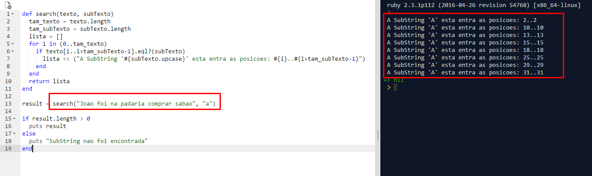

# Search Substring
  Implementação de um algoritmo de força-bruta (ou inocente) de pesquisa de substrings em uma string, o qual originalmente recebe uma string s e uma substring sub e retorna a posição em que a substring sub ocorre na string s. Este problema é clássico em algoritmos e frequentemente discutido em disciplinas de estruturas de dado ou algoritmo. A solução usando força-bruta é a solução mais simples mas mais ineficiente para este problema.

# Problemas
  ## 1. O tipo string nessa linguagem de programação, é mutável ou imutável?
    String's em Ruby é mutável.
  ## 2. Como a implementação da linguagem armazena a informação sobre o tamanho de uma string e é possível obtê-la em um programa?
    String's são armazenadas em cadeias ou conjunto de caracteres.
    As Strings podem ser delimitadas por aspas duplas ou aspas simples.
    Em ruby String's são objetos que permite o programador utilizar vários metodos.
    
    Para obter o tamanho de uma string, é possivel utilizar o metodo: length.
    Veja exemplo:    
```ruby
      tam_texto = texto.length 
      ## A variável tam_texto recebe o tamanho da string que está na variável (objeto) texto.
```
  ## 3.O tamanho de uma string é estático ou dinâmico?
    Dinâmico, uma vez que string's em ruby é mutável é possivel adicionar/remover caracteres.
  ## 4. Como os operadores de atribuição = e comparação == funcionam quando utilizados entre strings? Caso os operadores não realizem a atribuição e comparação tradicionais quando aplicados a strings, mostre (por meio de exemplos) como um programador deveria realizar tais operações com strings.
  O operador = faz uma atribuição tradicional, porem como string é mutavel é possivel indicar se deseja alterar apenas um caractere em especifico da string ou se deseja alterar a string em um todo.
```ruby
      texto = "Linguagens de Programação"
      texto[0] = "X" ## Irá substituir apenas o primeiro caractere da string "L" por "X"
      texto =  "X" ## Irá substituir toda a string pelo caractere "X"
```
  O operador == faz comparação tradicional, contudo é possível comparar o valor de strings usando um metodo especifico de strings.
  ####  Forma Tradicional
```ruby
      texto = "Linguagens de Programação"
      texto2 = "UFG"
      
      if texto == texto2 ## Forma Tradicioal de comparação funciona corretamente em Ruby
        puts "Textos Iguais"
      else
        puts "Textos Diferentes"
      end
```
  #### Forma Diferente
```ruby
      texto = "Linguagens de Programação"
      texto2 = "UFG"
      if texto.eql?(texto2) ## Forma Diferente de realizar comparação, dessa forma o metodo "eql" é invocado passando como parametro a string a ser comparada.
        puts "Textos Iguais"
      else
        puts "Textos Diferentes"
      end 
```
# Saída
  <p align="center"></p>
